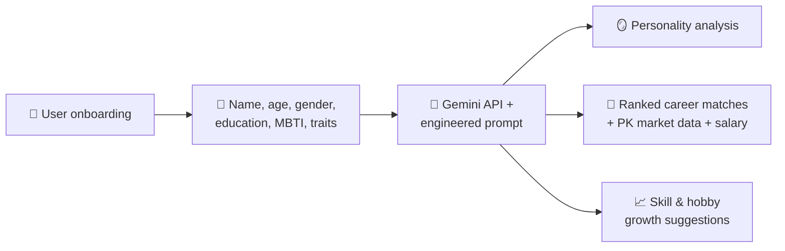

# 🧭 Simt AI

**Simt** (سمت) means *"direction"* in Urdu — and that's exactly what this app gives Pakistani students and job-seekers who are unsure what career path to take.

🏆 *Built during the PakAngels Hackathon — earned a Top Performer certificate.*

## 💡 Why This Exists

Pakistan has no shortage of talent — but it has a serious shortage of career counselling. Most students never get proper guidance on which direction actually fits them, so a huge number end up drifting into careers that don't match their real strengths or interests, and spend years feeling stuck or unfulfilled.

People do their best work — and are genuinely happiest — when they're working in a field that fits who they actually are. Simt AI exists to close that gap: it looks at a person's personality, interests, and background, and turns that into clear, actionable, *Pakistan-specific* career direction — something most students never get access to.

🔗 **[Try it live](https://simt-ai-one.vercel.app/)**

## ✨ Features

- 🌐 **Fully bilingual** — the entire experience is available in both **English and Urdu** (with proper RTL layout), so it's genuinely accessible across Pakistan, not just to English speakers
- 🧠 **Deep personalization** — recommendations are generated from the user's name, age, gender, education, MBTI personality type, personal traits, and experience, not a generic quiz
- 🇵🇰 **Pakistan-specific career matching** — every suggested career path comes with a strategic match score, a written rationale for *why* it fits this specific person, current market outlook in Pakistan, and an estimated local monthly salary range (PKR)
- 📈 **Growth-oriented, not just descriptive** — beyond matching careers, it suggests specific skills to develop based on the user's actual interests, plus new hobbies aligned with their personality
- 🪞 **Personality analysis** — generates a short written analysis connecting the user's name, personality type, and traits into a coherent professional narrative
- ⭐ **Feedback loop** — after seeing their results, users can rate how accurate their matches felt (1–5 stars) plus an optional comment. Ratings are stored in Firebase Firestore, giving a real, growing signal of recommendation quality over time

## 📊 Measuring Success

Rather than assuming the recommendations are useful, Simt AI closes the loop by asking users directly: *how accurate did this feel?* Every rating is persisted to a Firestore `feedback` collection (write-only from the client — no one but the project owner can read the collected data), which makes it possible to compute, over time:

- **Average satisfaction score** across all users
- **% of users who rated 4–5 stars** — a practical proxy for "success rate"
- Whether specific career categories or personality types tend to get more or less accurate matches

As of now, this is a freshly launched feature — the rating distribution isn't yet meaningful (too few responses to report honestly). The mechanism is fully built and working end-to-end; a satisfaction dashboard/graph derived from this data is a natural next step once enough real feedback accumulates (see Future Improvements).

## 📸 Screenshots

**Onboarding — English**


**Result Screen — English**


**Career Matches — with market data & salary estimates**


**Personality Analysis**


**Onboarding — Urdu (fully localized, RTL)**


**Result Screen — Urdu**


## 🏗️ Architecture



## 🛠️ Tech Stack

| Component | Technology |
|---|---|
| Frontend | React + TypeScript |
| Build tool | Vite |
| AI engine | Google Gemini API |
| Feedback storage | Firebase Firestore |
| Prototyping environment | Google AI Studio |
| Hosting | Vercel |

## 🧠 How It Was Built

This project was prototyped and developed using **Google AI Studio** and the Gemini API, within the time constraints of a hackathon. Development focused on:
- Designing the onboarding flow to capture meaningful personality and background signals (not just surface-level preferences)
- Engineering the AI prompt to translate those signals into specific, Pakistan-market-aware career recommendations with real salary and outlook data, rather than generic advice
- Building full English/Urdu bilingual support with correct RTL rendering for Urdu
- Iterating on the recommendation prompt and MBTI-based logic across multiple passes to improve relevance and personalization

## 🚀 Run Locally

**Prerequisites:** Node.js

```bash
git clone https://github.com/heresfatima/Simt-AI.git
cd Simt-AI
npm install
```

Create a `.env.local` file in the project root:
```
GEMINI_API_KEY=your_gemini_api_key_here
```

Get a free key from [Google AI Studio](https://aistudio.google.com/api-keys).

Run the app:
```bash
npm run dev
```

## ⚠️ Known Limitations

- This was built as a **time-boxed hackathon prototype**, not a production-ready application — some edge cases in user input may not be handled gracefully
- No persistent user accounts or history — each session is independent
- Career and salary data is generated by the model's reasoning rather than validated against a live, continuously updated Pakistani labor-market database

## 🔮 Future Improvements

- Build a satisfaction dashboard visualizing average rating and success rate once enough feedback accumulates
- Validate career/salary data against real, up-to-date Pakistani labor market sources
- Add persistent user profiles to revisit and track recommendations over time
- Expand personality assessment beyond MBTI (e.g. Big Five)

## 📄 About

Simt AI is a bilingual (English/Urdu) web app that gives Pakistani students and job-seekers personalized, data-backed career direction — because everyone deserves to know their "simt."
